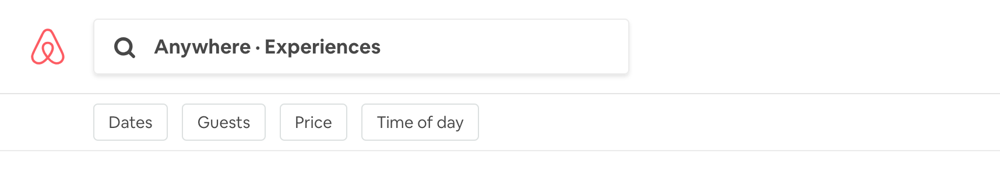
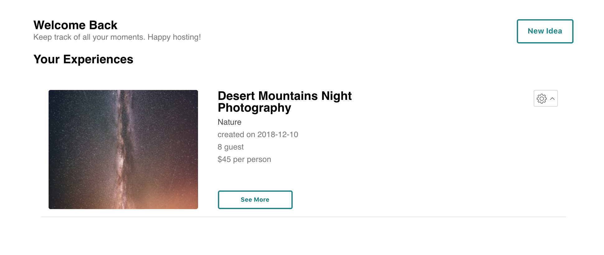

## Airmoment

Speaking to contributions by Jemila Al-Ghani <br>
* Styling <br>
* Wizard (13) <br>
* Filter functionality on header (modal)<br>
* New Technologies: Context Api, Cloudinary and Bcrypt <br>


### Background
This is a e-commerce web application. Users are able to become host and buy experiences from other host. 

Check out the live version [here](https://airmoment.live/)

### Technology

The application uses PostgreSQL, Node, Express and Massive to manage the backend. In order to manage state and the frontend, I used ReactJS, as well as SASS for frontend styling.

I individually implemented and researched Context Api, Cloudinary and Bcrypt. 

### Styling 

Site-wide I lead the styling choices and template. For the most part, the styling is meant to mimic Airbnb's. 

**I personally styled and created** <br>
1. the header, <br>
2. the login & sign up page _(bcrypt)_,  <br>
3. the wizards(13) _(cloudinary, react-slick and context api)_,  <br>
4. the host & trip page,  <br>
5. the description of the experiences on the landing,<br>
6. and images on the landing page, <br>  <br>


_Number One_ 


vs.


_Number Four_


_Number Six_ 

The video is placed directly under the image. On hover, the image transitions to opacity 0. 

### Wizard
I created a wizard for a host to use when creating a new experience. The wizard consists of 13 steps. Each step is a index of an array (displayed below). When a host clicks the next button the index of the array is incremented and the previous button decrements. The information provided is preserved by Context Api, so all previously input information is preserved. 

The array is wrapped in a form tag so that I can make every step required. At the end of the Wizard, a host can review their inputs which also includes photos put into Cloudinary. The two photos a host is allowed to input are put into a slideshow with react-slick. 

```
let array = [
      <WizardOne />,
      <WizardTwo />,
      <WizardThree />,
      <WizardFour />,
      <WizardFive />,
      <WizardSix />,
      <WizardSeven />,
      <WizardEight />,
      <WizardNine />,
      <WizardTen />,
      <WizardEleven />,
      <WizardTwelve />,
      <WizardEnd post={this.postToDatabase} />
    ];
   
   
    <div className="wizard">
        {this.state.pageNumber === 12 && <h2>Review Moment</h2>}
        <form onSubmit={e => this.increment(e)}>
          {array[this.state.pageNumber]}
          <div className="wizard-button-container">
            {this.state.pageNumber === 0 ? (
              <Link to="/host">
                <button className="wizard-nextbutton">Back</button>
              </Link>
            ) : (
              <button
                className="wizard-nextbutton"
                onClick={e => this.decrement(e)}
              >
                Previous
              </button>
            )}
            {this.state.pageNumber === 11 ? (
              <button
                className="wizard-nextbutton"
                onClick={() => this.duration()}
              >
                Review
              </button>
            ) : this.state.pageNumber >= 12 ? null : (
              <input
                className="wizard-nextbutton"
                type="submit"
                value={this.state.review ? "Finialize" : "Next"}
              />
            )}
          </div>
        </form>
      </div>
```
### Filter Header Buttons


```
filter() {
    const { cat, priceValue, guestSize } = this.state;
    axios
      .post("/api/filtermoment", {
        price: priceValue,
        group_size_limit: guestSize,
        category: cat
      })
      .then(response => {
        this.props.context.updateInfo("filteredMoments", response.data);
      });
  }
```
I wanted to allow for users to filter by multiple factors(3); and thus I need to factor in case where a user might search by only one or two factors. 

```
  filter: (req, res) => {
    let moment = {};
    const db = req.app.get("db");
    if (req.body.category) {
      if (req.body.price > 1) {
        db.filter([
          req.body.price,
          req.body.group_size_limit,
          req.body.category
        ])
          .then(data => {
            moment = Object.assign(data, {});
            db.filter_photo([
              req.body.price,
              req.body.group_size_limit,
              req.body.category
            ]).then(photo => {
              res.json(addPhotosToMoment(moment, photo));
            });
          })
          .catch(error => {
            console.error("error in filter1", error);
          });
      } else {
        db.filter([5000, req.body.group_size_limit, req.body.category])
          .then(data => {
            moment = Object.assign(data, {});
            db.filter_photo([
              5000,
              req.body.group_size_limit,
              req.body.category
            ]).then(photo => {
              res.json(addPhotosToMoment(moment, photo));
            });
          })
          .catch(error => {
            console.error("error in filter2", error);
          });
      }
    } else {
      if (req.body.price > 1) {
        db.filter_by_price_guest([req.body.price, req.body.group_size_limit])
          .then(data => {
            moment = Object.assign(data, {});
            db.filter_by_price_guest_photo([
              req.body.price,
              req.body.group_size_limit
            ]).then(photo => {
              res.json(addPhotosToMoment(moment, photo));
            });
          })
          .catch(error => {
            console.error("error in filter3", error);
          });
      } else {
        db.filter_by_price_guest([5000, req.body.group_size_limit])
          .then(data => {
            moment = Object.assign(data, {});
            db.filter_by_price_guest_photo([
              5000,
              req.body.group_size_limit
            ]).then(photo => {
              res.json(addPhotosToMoment(moment, photo));
            });
          })
          .catch(error => {
            console.error("error in filter4", error);
          });
      }
    }
  }
```
